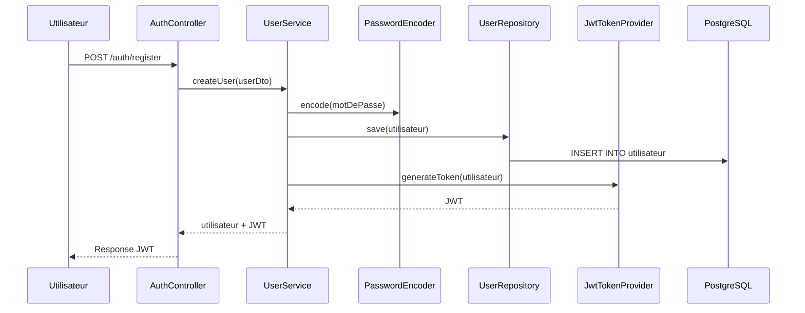

```mermaid

sequenceDiagram

    participant Utilisateur
    participant AuthController
    participant UserService
    participant PasswordEncoder
    participant UserRepository
    participant JwtTokenProvider
    participant PostgreSQL

    Utilisateur->>AuthController: POST /auth/register
    AuthController->>UserService: createUser(userDto)
    UserService->>PasswordEncoder: encode(motDePasse)
    UserService->>UserRepository: save(utilisateur)
    UserRepository->>PostgreSQL: INSERT INTO utilisateur
    UserService->>JwtTokenProvider: generateToken(utilisateur)
    JwtTokenProvider-->>UserService: JWT
    UserService-->>AuthController: utilisateur + JWT
    AuthController-->>Utilisateur: Response JWT
    
```